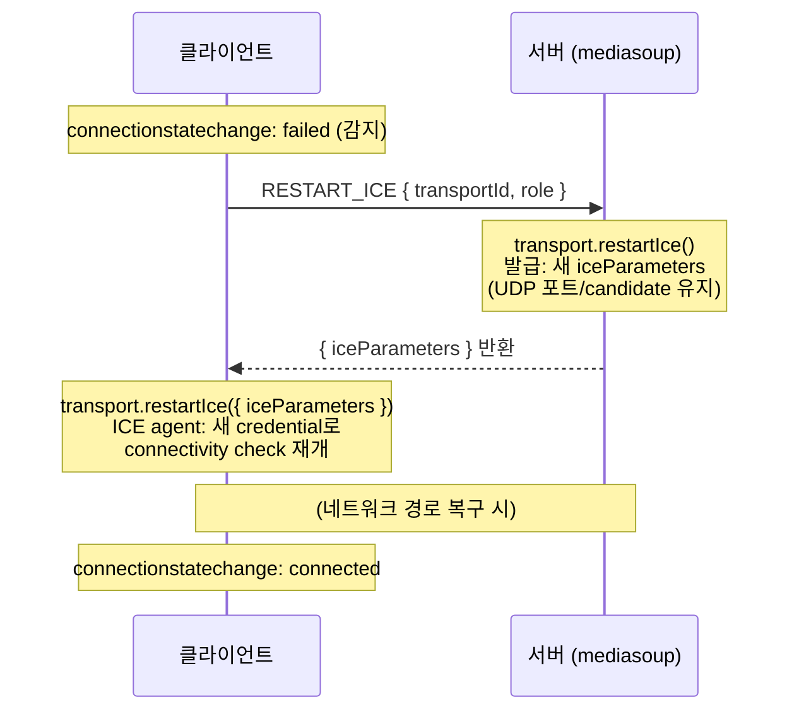

# ICE Restart

> **👉 읽기 전 참고 자료**
> ICE가 대체 무엇인지, 그리고 암구호 역할을 하는 `ufrag`와 `pwd`가 왜 필요한지, 이를 실제 코드에서는 어떻게 다루는지 헷갈린다면 아래 문서를 먼저 확인하세요.
> [배경지식: ICE 기초 원리와 코드 적용 파헤치기](./ice-background.md)

---

## ICE Restart란

ICE agent가 `failed` 상태에 도달하면 RFC 8445에 따라 connectivity check를 완전히 중단한다.
이 상태에서 네트워크가 복구되어도 자동으로 재연결되지 않는다.

ICE restart는 새로운 ICE credential(ufrag/pwd)을 발급해서
ICE agent에게 "이건 새로운 세션이다"라고 인식시키는 것이다.
기존 세션은 포기했지만, 새 세션이니까 처음부터 connectivity check를 다시 시작한다.

> **💡 부연 설명: 스펙상의 트리거와 상태 머신 초기화**
> WebRTC 및 ICE(RFC 8445) 스펙에 따르면, ICE Agent는 단순히 "재시작하라"는 명령을 받는 것이 아니라, 전달받은 **ICE `ufrag`나 `pwd`가 이전 세션과 달라진 것을 감지**했을 때 비로소 기존의 실패한 상태를 버리고 ICE Restart 프로세스를 시작합니다.
> 
> 네트워크 단절이 길어져 `failed` 상태에 빠진 ICE Agent는 기존 credential 하에서는 더 이상 어떤 통신 시도도 하지 않도록 설계되어 있습니다. 따라서 새 credential을 부여해 **"이전의 실패한 상태와는 무관한 완전히 새로운 세션의 시작"**이라고 상태 머신을 속이는(리셋하는) 것이 ICE Restart의 본질입니다.

핵심: credential 갱신은 보안적 이유가 아니라,
`failed`에서 멈춘 ICE agent의 상태 머신을 리셋하기 위한 수단이다.

## `disconnected` vs `failed` — ICE restart가 필요한 시점

| 상태 | ICE Agent 동작 | 네트워크 복구 가능성 | 상세 설명 |
| :--- | :--- | :--- | :--- |
| **`disconnected`** | 기존 candidate pair로 <br/>Liveness/Consent Check 시도 중 | **자동 복구 가능** <br/>(Restart 불필요) | 일시적인 패킷 유실이나 짧은 네트워크 단절 시 |
| **`failed`** | 모든 Connectivity Check <br/>중단 및 프로세스 포기 | **자동 복구 불가** <br/>(Restart 필수) | 15~30초 초과 단절 혹은 네트워크 경로 상실 시 |

Chrome 기준 `disconnected` → `failed` 전이는 약 5~30초 소요.
즉 짧은 끊김은 자동 복구되고, 긴 끊김만 ICE restart가 필요하다.

## mediasoup에서의 ICE restart 흐름

일반 WebRTC의 `RTCPeerConnection.restartIce()`와 달리
mediasoup은 SDP offer/answer 교환 없이 transport 레벨 API를 사용한다.



### "ICE Restart 성공"과 "연결 복구"는 별개

`transport.restartIce({ iceParameters })`가 성공했다는 것은:
- 새 credential이 **적용**되었다는 뜻
- ICE agent가 connectivity check를 **시작**했다는 뜻
- 연결이 **복구**되었다는 뜻이 **아님**

네트워크가 여전히 차단 상태면 check가 실패하고 다시 `failed`로 빠진다.

## ICE restart가 필요한 실제 시나리오

### 1. Wi-Fi 일시적 끊김 (30초 이상)

```
카페에서 공부 중 → Wi-Fi AP 재부팅 (30초~1분)
→ consent check 실패 → disconnected (5초) → failed
→ Wi-Fi 복구되었지만 ICE agent는 이미 포기한 상태
→ restartIce() → 같은 IP, 같은 경로지만 새 세션으로 인식 → connected
```

### 2. 네트워크 전환 (Wi-Fi → LTE / LTE → Wi-Fi)

```
Wi-Fi 연결 중 → 외출하며 LTE로 전환
→ 클라이언트 IP 자체가 변경됨 (192.168.x.x → 10.x.x.x)
→ 기존 candidate pair 무효
→ restartIce() → 새 candidate 수집 + 새 credential → connected
```

이 경우 credential 갱신뿐 아니라 새로운 candidate 수집이 함께 일어나므로
ICE restart가 더욱 필수적이다.

### 3. NAT 리바인딩 (장시간 세션)

```
뽀모도로 장시간 사용 (2시간+)
→ NAT 테이블의 UDP 매핑 만료 (통신사/라우터마다 다름, 30초~5분)
→ 서버가 알고 있던 클라이언트 공인 IP:port가 무효화
→ restartIce() → 새 STUN check로 현재 유효한 NAT 매핑을 서버에 알림
```

## Connectivity check와 STUN Binding Request

ICE connectivity check는 STUN Binding Request 그 자체다.
같은 프로토콜, 같은 메시지 포맷이지만 용도와 시점에 따라 이름이 다르다.

| 용도 | 대상 | 시점 |
|---|---|---|
| Candidate 수집 (Gathering) | STUN 서버 | ICE 시작 시 |
| Connectivity Check | 상대방 peer (또는 SFU 서버) | ICE negotiation 중 |
| Consent Freshness (RFC 7675) | 현재 연결된 상대 | 연결 후 주기적 (약 5초 간격) |

Consent freshness check가 약 30초간 응답 없으면 `disconnected` → `failed`.
ICE restart는 새 credential로 connectivity check를 다시 보내게 만드는 것이다.

## 현재 구현: polling 기반 재시도

`registerTransportConnectionStateLogger` 함수에서 구현됨.

### 흐름

1. `connectionstatechange`에서 `failed` 감지
2. 서버에 `RESTART_ICE` emit → 새 `iceParameters` 수신
3. `transport.restartIce({ iceParameters })` 적용
4. 10초 대기 후 상태 확인 → 여전히 `failed`면 재시도

### polling이 필요한 이유

`failed` 상태에서는 `connectionstatechange` 이벤트가 더 이상 발생하지 않으므로,
네트워크 복구를 감지할 passive한 수단이 없다.
주기적으로 ICE restart를 시도해서 check를 보내보는 수밖에 없다.

### 개선 여지

| 항목 | 현재 | 권장 |
|---|---|---|
| 재시도 횟수 | 무제한 | 5~10회 제한 |
| 재시도 간격 | 고정 10초 | exponential backoff (3s → 6s → 12s → ...) |
| 최종 실패 시 | 아무 처리 없음 | 사용자 알림 또는 `leaveRoom()` |
| 타이머 정리 | `transport.closed` 체크로 간접 방어 | `clearTimeout`으로 명시적 정리 |

## iptables 테스트 방법

ICE restart를 테스트하려면 `failed` 상태까지 도달해야 한다.

```bash
# 1. UDP 차단 (mediasoup transport의 port를 대상으로)
sudo iptables -A OUTPUT -p udp --dport <PORT> -j DROP

# 2. disconnected → failed 까지 대기 (약 5~30초)

# 3. ICE restart 발동 확인 (콘솔 로그)

# 4. UDP 해제
sudo iptables -D OUTPUT -p udp --dport <PORT> -j DROP

# 5. 다음 ICE restart 시도에서 connected 복구 확인
```

주의: `DROP`을 사용해야 한다. `REJECT`는 즉시 ICMP 응답을 보내므로
실제 네트워크 끊김과 다른 양상이 된다.

주의: `disconnected` 단계에서 차단을 해제하면 ICE restart 없이 자동 복구된다.
반드시 `failed`까지 기다려야 ICE restart 로직을 테스트할 수 있다.
