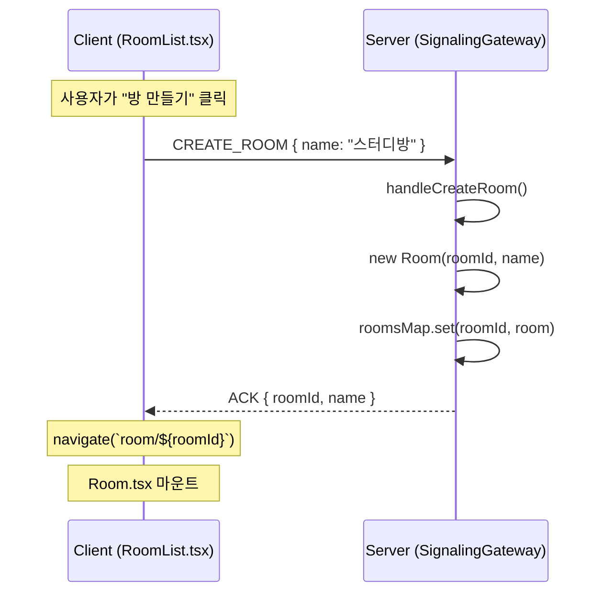
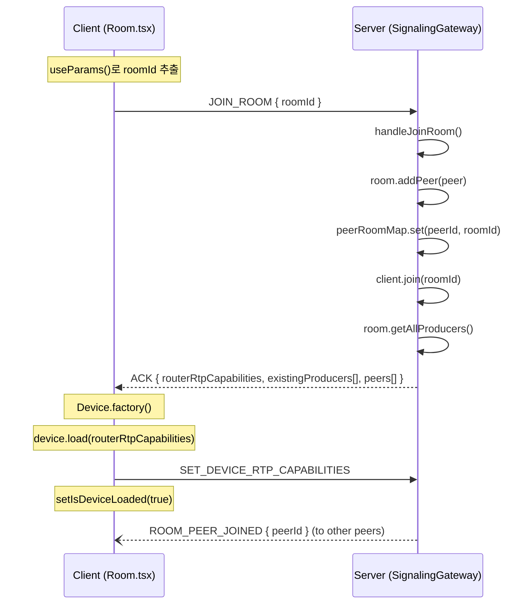
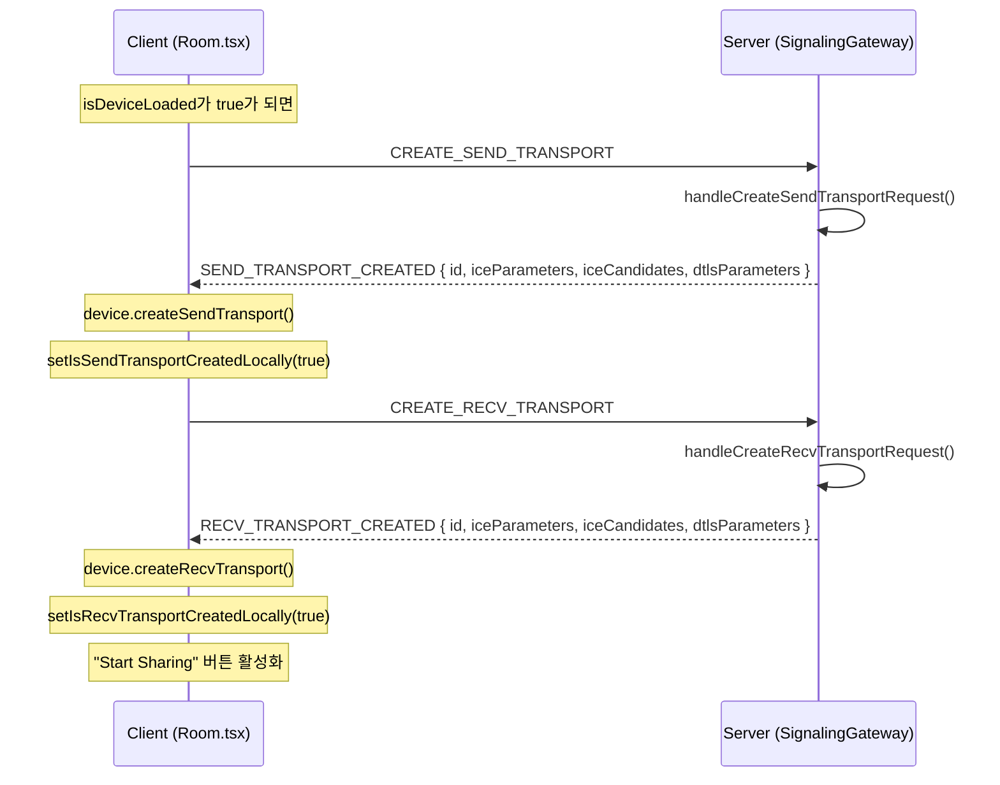
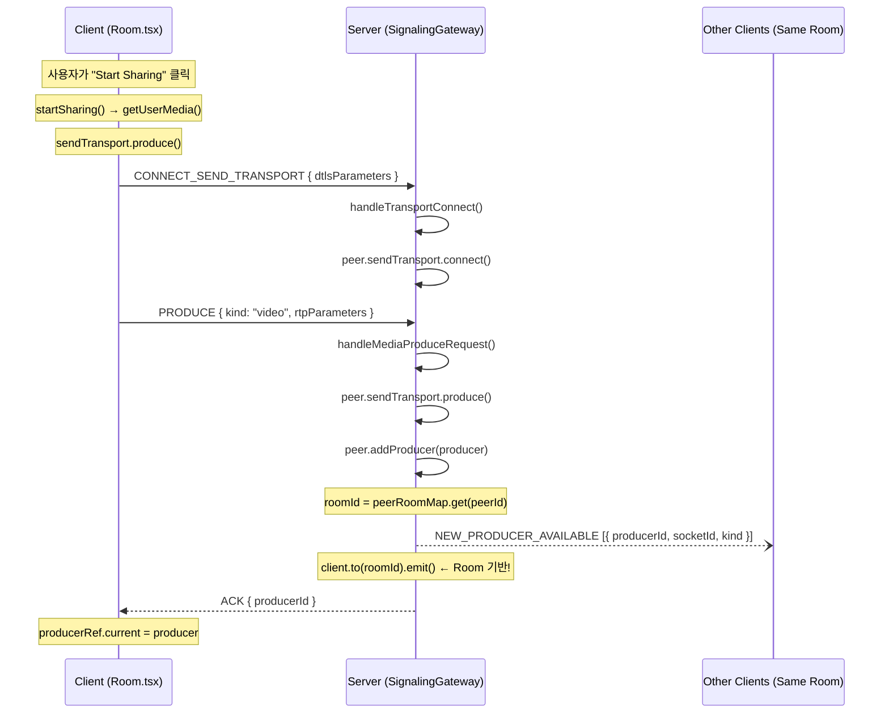
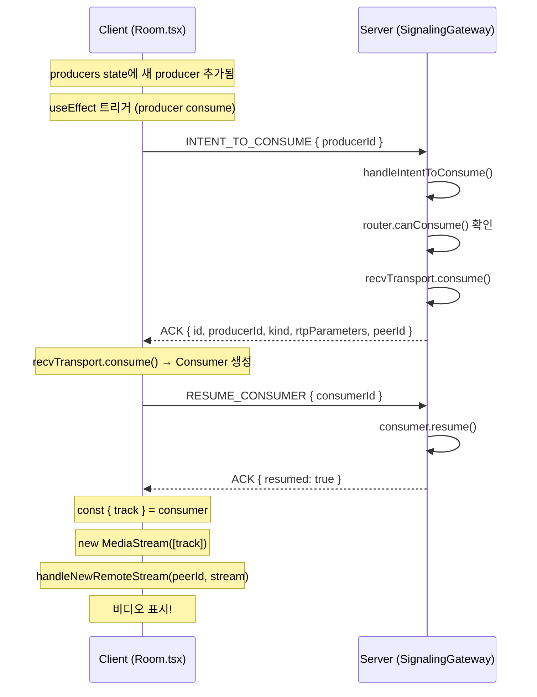
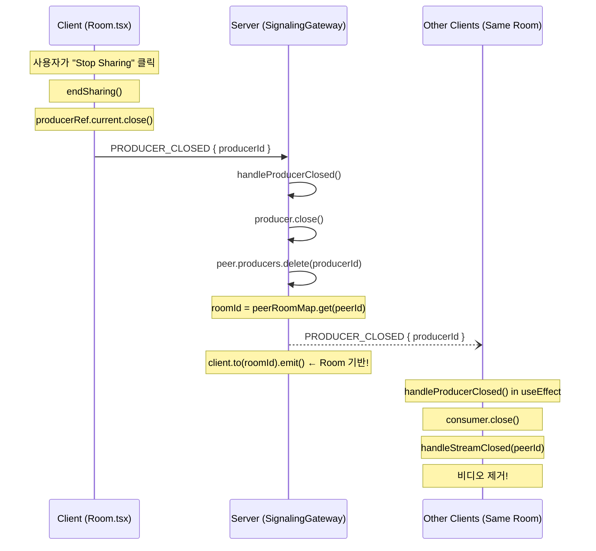
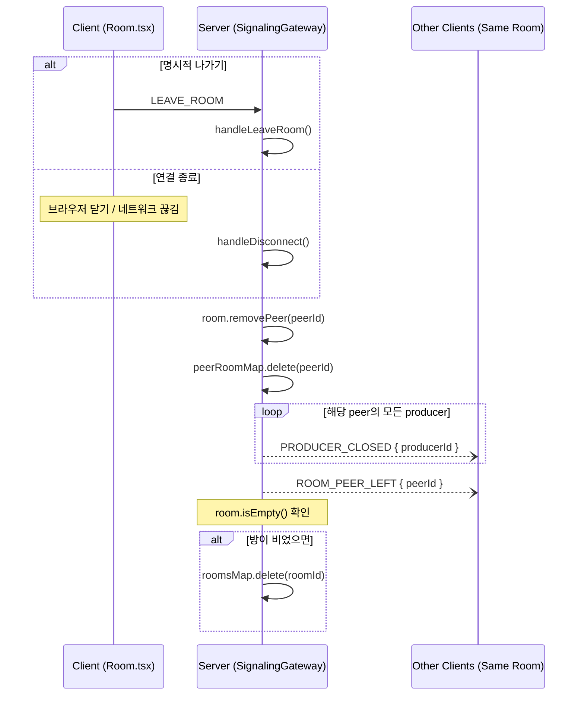

# Room Feature - Sequence Diagrams

## 1. 방 생성 후 입장 (Create Room & Join)



---

## 2. 방 참가 (Join Room)



---

## 3. Transport 생성 및 Media 공유



---

## 4. Video Producer 생성



---

## 5. Video Consumer 생성 (다른 사람 영상 받기)



---

## 6. 공유 종료 (Producer Close)



---

## 7. 방 나가기 / 연결 종료



---

## 핵심 포인트: Room 기반 격리

```
Before (전체 broadcast):
  client.broadcast.emit(EVENT, data)  ← 모든 연결된 클라이언트에게

After (Room 기반):
  const roomId = peerRoomMap.get(client.id)
  client.to(roomId).emit(EVENT, data)  ← 같은 방에만!
```

**영향받는 이벤트:**

- `NEW_PRODUCER_AVAILABLE`
- `PRODUCER_CLOSED`
- `ROOM_PEER_JOINED`
- `ROOM_PEER_LEFT`
