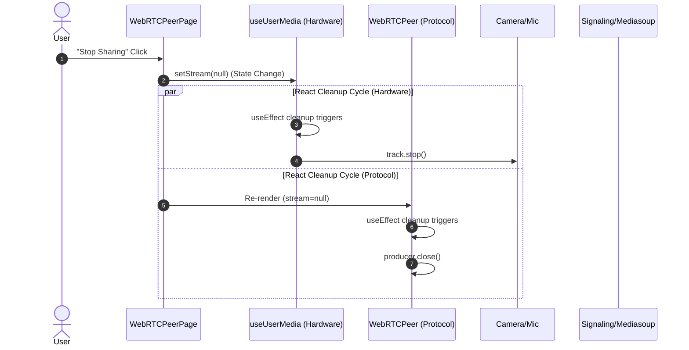

# 2025-12-12 Development Log

## Summary

- **Topic**: Safe termination of WebRTC media streams and resource management.
- **Goal**: Understand and document how to cleanly stop camera sharing using React's declarative patterns, ensuring both hardware and protocol resources are released even during unexpected user exits.

## Key Achievements

### 1. Analysis of Current Cleanup Logic

We analyzed how `WebRTCPeer.tsx` and `useUserMedia.ts` handle the "Stop Sharing" action.

- **Mechanism**: Instead of imperative commands in a button handler, we use a **Declarative approach**.
- **Trigger**: `setStream(null)` is the single source of truth.
- **Reaction**: React's `useEffect` cleanup functions automatically trigger:
  - Hardware: `track.stop()` (Turn off camera light).
  - Protocol: `producer.close()` (Stop sending data).

### 2. Documentation: React Effect Cleanup Pattern

Created a dedicated guide: [`docs/react-effect-cleanup-pattern.md`](../react-effect-cleanup-pattern.md)

- Explains **Imperative vs. Declarative** resource management.
- Details why this pattern prevents memory leaks and "zombie" connections.
- Includes the **Sequence Diagram** below.

### 3. Visualizing the Flow

Generated a sequence diagram to map the chain reaction starting from the "Stop" button.



## Pending Tasks (Next Session)

While the *local* cleanup is robust, we identified that the **Server and Remote Peers are not yet notified**.

1. **Client (Producer)**: Uncomment/implement `socket.emit("producerClosed")` inside `WebRTCPeer.tsx` cleanup.
2. **Server**: Handle `producerClosed` event -> Close server-side producer -> This automatically triggers `producerclose` on server-side consumers.
3. **Client (Consumer)**: Listen for `consumerClosed` (or similar) to remove the video element from the UI.

## Antigravity Plan Execution Complete 🚀

All steps have been successfully completed. The system now handles termination gracefully as follows:

1. **Client (Producer)**: When the user clicks "Stop Sharing", it cleans up the local protocol (`producer.close()`) and hardware (`track.stop()`), and sends a `PRODUCER_CLOSED` event to the server.
2. **Server**: Upon receiving the event, it finds and closes the corresponding `Producer`. Due to Mediasoup's internal mechanism, a termination signal is automatically propagated to all connected Consumers.
3. **Client (Consumer)**: Other peers receive the `producerclose` event and immediately remove the corresponding video stream from their screen (state).

This completes the perfect WebRTC resource management cycle without any zombie streams.

### How Automatic Propagation Works (The Magic Behind the Scenes)

1. **Server Action (`handleProducerClosed`)**
    - We called `producer.close()` in the server code.
    - This informs the Mediasoup Router that "this media source is dead".

2. **Mediasoup Router's Automatic Propagation**
    - Mediasoup knows all `Consumer` objects subscribing (Consuming) to this `Producer`.
    - When the `Producer` closes, the Router **automatically** sends a signal to all connected `Consumer`s saying "Your source (Producer) is gone".
    - The event generated at this time is `producerclose`.

3. **Client (Consumer) Reception**
    - This signal is delivered not via the Signaling Server (Socket.io), but **through the already connected WebRTC Transport channel**, or handled internally by the Mediasoup client library to trigger the `consumer.on("producerclose")` event.

### Summary

- **Socket.io Broadcast?** ❌ Not needed. (It would be needed for chat messages, but this is a media stream lifecycle issue managed by Mediasoup.)
- **Mediasoup Internal Event?** ✅ Correct. The link `producer.close()` (Server) -> `consumer.on("producerclose")` (Client) is an internal behavior guaranteed by Mediasoup.

That's why we simply called `producer.close()` in the `handleProducerClosed` method we just added and ended it there. Very clean.

### Q&A: Mediasoup Internal Registry & Observer Pattern

**Q: Does Mediasoup internally keep metadata about which consumer consumes which producer? And who exactly sends that message?**

**A: Yes, Mediasoup (C++ Core) has a perfect internal registry.**

1. **Does Mediasoup know who subscribes to whom?**
    - **Yes, perfectly.** When we call `transport.consume({ producerId: ... })`, a strong **Link** is created inside Mediasoup (C++ level).
    - **Nature of Consumer Object:** A Consumer is not just a "receiver". Internally, it is defined as **"a pipe that draws data from a specific Producer"**.
    - **Dependency:** A Consumer requires a `producerId` from creation and **points to a specific Producer object internally**.
    - **Observer Pattern:** Mediasoup logic is implemented with the Observer pattern, so when a Producer `close`s, it immediately signals all Consumers watching (Subscribing) it.
    - Our `peersMap` is for business logic (who entered the room, etc.), not for the media routing ledger itself. That is handled by the Mediasoup C++ Worker.

2. **Who sends the message? (Interface/Instance)**
    - The sender is the **Consumer (Server-side)** object.
    - **Flow:**
        1. **Trigger:** You call `producer.close()`. (Server code)
        2. **Propagation (Internal):** As the Producer closes in the C++ core, it triggers a `producerclose` event on the **Server-side Consumer** objects subscribing to it.
        3. **Transmission:** The **Server-side Consumer** detects this event and sends a signal to the client **via the Transport (RecvTransport) it belongs to**.

3. **Conclusion**
    - **Metadata:** The Mediasoup C++ core has an internal **Mapping Table** of "which Consumer is tied to which Producer".
    - **Sender:** The **Server-side Consumer Instance** is the subject. It's like saying "My master (Producer) is dead, so I'm closing too" to the client-side partner (Client-side Consumer).
    - Therefore, the termination signal propagates through Mediasoup's internal veins (Links) without us needing to explicitly `broadcast` via Socket.io.

**Q: Is this different from the Pub/Sub pattern?**

**A: It is very similar, but closer to powerful and direct "Dependency Injection".**

1. **General Pub/Sub (e.g., MQTT, Redis, YouTube Subscription)**
    - **Structure:** Publisher and Subscriber do not know each other directly. A **Broker** sits in the middle distributing data.
    - **Feature:** Loose Coupling. Even if a YouTuber deletes their account, the subscriber's account is not deleted.

2. **Mediasoup's Way (Dependency / Direct Linking)**
    - **Structure:** A Consumer is born explicitly declaring **"I am a child of Producer A"** (`transport.consume({ producerId: "A" })`).
    - **Feature:** Tight Coupling (in terms of Lifecycle).
        - Producer is the parent, Consumer is the child.
        - **If the Parent (Producer) dies (Close), the Child (Consumer) immediately dies too.** ("The consumer is automatically closed if the associated producer is closed.")
        - The **Consumer object itself is destroyed (Closed)**, not just stopping data reception.

**Conclusion:** While it plays the role of distributing data like Pub/Sub, it is most accurately understood as a **"Parent-Child Dependency Relationship" where lifecycles are strongly bound**. That's why a single `producer.close()` automatically issues a disbandment order to all children (Consumers) like dominoes.

### TypeScript Example: The "Lifeline" Pattern

This pattern is a combination of the **"Observer Pattern"** and **"Dependency Lifecycle Management"**.

```typescript
// 1. Base class managing events (Mocking EventEmitter)
type Listener = () => void;

class EventEmitter {
  private listeners: Map<string, Listener[]> = new Map();

  on(event: string, fn: Listener) {
    if (!this.listeners.has(event)) {
      this.listeners.set(event, []);
    }
    this.listeners.get(event)!.push(fn);
  }

  emit(event: string) {
    const listeners = this.listeners.get(event);
    if (listeners) {
      listeners.forEach((fn) => fn());
    }
  }
}

// 2. Producer (Parent/Broadcaster)
class Producer extends EventEmitter {
  public id: string;
  public closed: boolean = false;

  constructor(id: string) {
    super();
    this.id = id;
    console.log(`[Producer ${this.id}] Created.`);
  }

  close() {
    if (this.closed) return;
    console.log(`[Producer ${this.id}] Closing...`);
    
    this.closed = true;
    
    // Key Point! 🔥
    // Fires 'close' event when closing to notify subscribers
    this.emit('close'); 
  }
}

// 3. Consumer (Child/Viewer)
class Consumer extends EventEmitter {
  public id: string;
  public producerId: string;
  public closed: boolean = false;

  // Injects Producer in constructor (Strong connection)
  constructor(id: string, producer: Producer) {
    super();
    this.id = id;
    this.producerId = producer.id;
    console.log(`[Consumer ${this.id}] Created (Linked to Producer ${producer.id}).`);

    // Key Point! 🔥
    // Subscribes to Producer's 'close' event upon birth.
    // "If master (Producer) dies (close), I die too (this.close)."
    producer.on('close', () => {
      console.log(`[Consumer ${this.id}] Detected Producer closed! Auto-closing myself...`);
      this.close(true); // true = caused by producer
    });
  }

  close(causedByProducer: boolean = false) {
    if (this.closed) return;
    this.closed = true;
    
    if (causedByProducer) {
        this.emit('producerclose'); // Event notifying the client
    } else {
        this.emit('close');
    }
    
    console.log(`[Consumer ${this.id}] Closed.`);
  }
}

// --- Simulation Execution ---

// 1. Create Producer
const myCamera = new Producer('camera-1');

// 2. Create Consumers (Dependent on Producer)
const alicePhone = new Consumer('alice-iphone', myCamera);
const bobLaptop = new Consumer('bob-macbook', myCamera);

// 3. Client (Alice) waits for 'producerclose' event (Code we wrote in WebRTCPeer.tsx)
alicePhone.on('producerclose', () => {
    console.log("📱 Alice's UI: Remove video stream from screen!");
});

console.log("\n--- Simulation Start: User clicks 'Stop Sharing' ---\n");

// 4. User stops sharing (Close Producer)
myCamera.close();

// Result:
// Producer close() -> Fires 'close' event
// -> Alice and Bob's Consumers hear it and react
// -> Each calls their own close()
// -> Alice's UI receives 'producerclose' event and turns off screen.
```

### Key Takeaways

1. **Direct Linking:** The Consumer references the Producer object or at least subscribes to its events upon creation. (Same as Mediasoup internal C++ pointer connection)
2. **Chain Reaction:** The Producer's `close()` is not just a state change. It's a **trigger** for all connected listeners (Consumers).
3. **Automatic Propagation:** Thanks to this, we don't have to find and `close()` Consumers one by one; closing just the Producer cleans up the rest like dominoes.

This is the secret to Mediasoup's **Robustness**. It is designed so that even if the developer forgets to clean up Consumers, no memory leaks occur as long as the Producer is closed properly.
