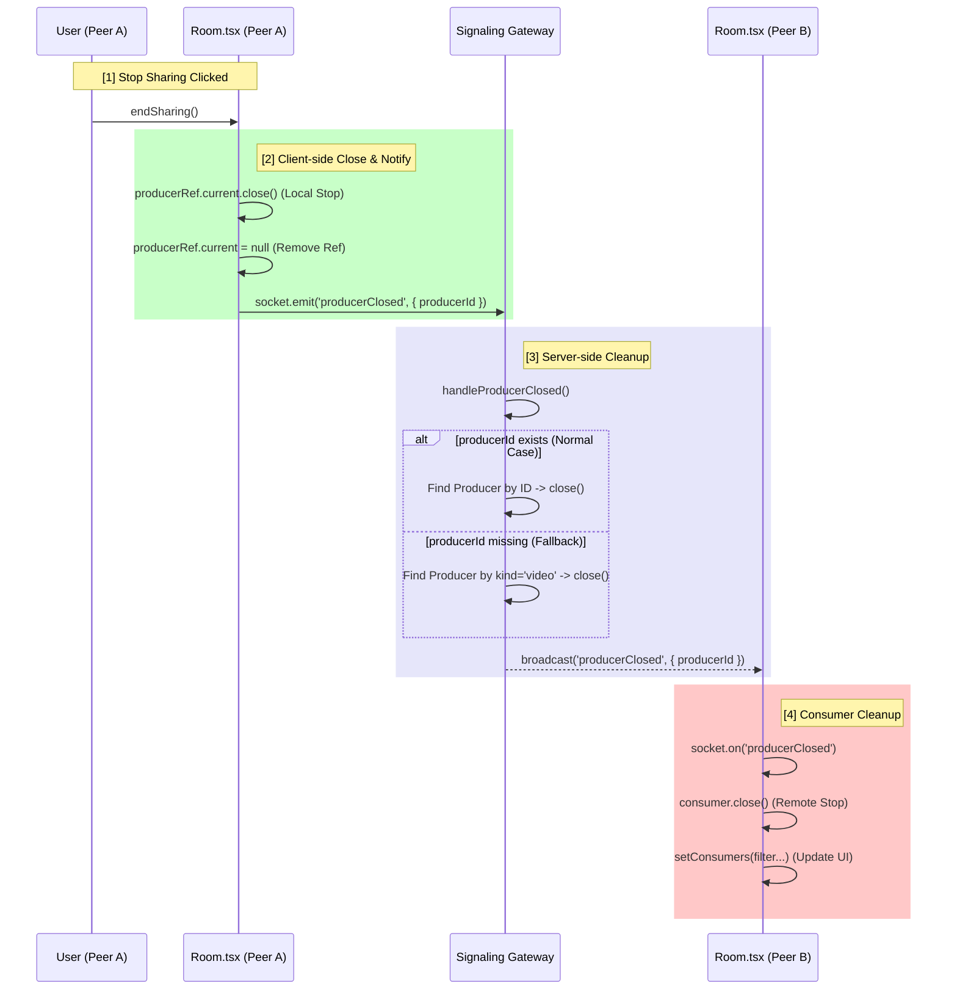

# Graceful Producer Close (Stop Sharing) Flow

This document outlines the implementation details and execution flow of the "Stop Sharing" functionality in our WebRTC application.

## 1. Overview
The "Stop Sharing" feature ensures that when a user stops sharing their screen/camera:
1.  The local producer is immediately closed.
2.  The server is notified via a dedicated socket event.
3.  The server cleans up resources and notifies all other connected peers.
4.  Other peers stop consuming the closed stream and update their UI.

## 2. Sequence Diagram



## 3. Implementation Details

### Client-Side (`Room.tsx`)

**`endSharing()` Function:**
Responsible for initiating the close process.

```typescript
function endSharing() {
  if (producerRef.current) {
    // 1. Close local producer immediately
    producerRef.current.close();
    
    // 2. Notify server
    socket?.emit(EventNames.PRODUCER_CLOSED, {
      producerId: producerRef.current.id,
    });
    
    // 3. Clear reference
    producerRef.current = null;
  } else {
    // Fallback: If ref is null for some reason, ask server to close by kind
    socket?.emit(EventNames.PRODUCER_CLOSED, {
      kind: 'video', 
    });
  }
}
```

### Server-Side (`signaling.gateway.ts`)

**`handleProducerClosed()` Method:**
Responsible for cleaning up server resources and broadcasting the event.

```typescript
@SubscribeMessage(EventNames.PRODUCER_CLOSED)
handleProducerClosed(client, payload) {
  const { producerId, kind } = payload;
  let targetProducerId = producerId;

  // Fallback Logic:
  // If no producerId is provided, search for the producer by 'kind'
  if (!targetProducerId && kind) {
    // ... search logic ...
    targetProducerId = foundProducer.id;
  }

  // Close the producer and notify others
  if (targetProducerId) {
    const producer = peer.producers.get(targetProducerId);
    producer.close();
    peer.producers.delete(targetProducerId);
    
    client.broadcast.emit(EventNames.PRODUCER_CLOSED, {
      producerId: targetProducerId 
    });
  }
}
```

## 4. Key Fixes & Design Decisions
1.  **Strict ACK Pattern**: We switched to NestJS's return-based ACK pattern for `produce` requests to ensure the client correctly receives the created `producerId`.
    *   *Old*: `ack({ producerId })` callback (Unreliable)
    *   *New*: `return { success: true, data: { producerId } }` (Reliable)
2.  **Fallback Mechanism**: Added a "Close by Kind" fallback. If the client loses track of the `producerId` (e.g., due to a race condition), it can still request to close "my video producer", guaranteeing the stream stops.
3.  **Listener Cleanup**: Strict cleanup of `produce` event listeners in `useEffect` to prevent duplicate handlers and race conditions.
