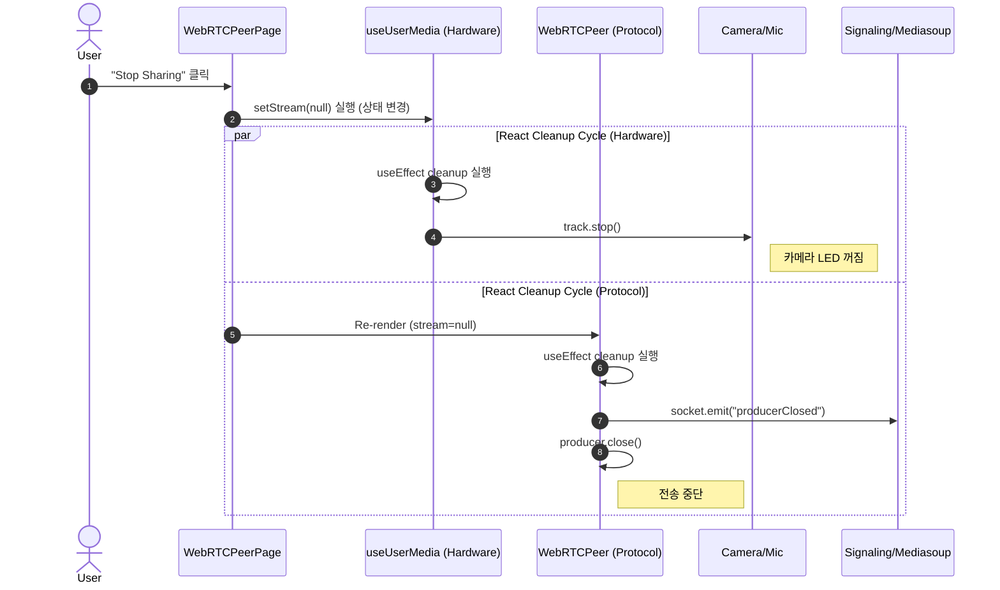

# React Effect Cleanup Pattern: Safe Resource Management in WebRTC

이 문서는 WebRTC 애플리케이션에서 **미디어 스트림(카메라/마이크) 공유 중단**과 **리소스 해제**를 안전하게 처리하기 위해 적용한 **"Effect Synchronization & Cleanup Pattern"**에 대해 설명합니다.

이 패턴은 React의 선언적(Declarative) 특성을 활용하여, 사용자의 돌발 행동(뒤로 가기, 탭 닫기 등)에도 하드웨어와 네트워크 리소스가 누수 없이 정리되도록 보장합니다.

---

## 1. 핵심 문제: "어떻게 끌 것인가?" (Imperative vs Declarative)

카메라 공유를 멈추는 기능(Stop Sharing)을 구현할 때, 두 가지 접근 방식이 있습니다.

### ❌ 명령형 방식 (Imperative) - "이것, 저것, 요것을 꺼라"
버튼 클릭 이벤트 핸들러에 모든 정리 로직을 몰아넣는 방식입니다.

```javascript
// 나쁜 예시 (Bad Practice)
const handleStopClick = () => {
  // 1. 하드웨어 끄기
  stream.getTracks().forEach(track => track.stop());
  // 2. 서버 연결 끊기
  producer.close();
  // 3. 상태 초기화
  setStream(null);
};
```
**위험성:** 사용자가 "Stop" 버튼을 누르지 않고 **뒤로 가기**를 하거나 **브라우저 탭을 닫으면**, 위 함수는 실행되지 않습니다. 결과적으로 카메라는 계속 켜져 있고(하드웨어 점유), 서버 연결도 유지됩니다(좀비 리소스).

### ✅ 선언적 방식 (Declarative) - "상태가 바뀌면 정리해라" (Our Approach)
우리는 **"현재 스트림이 없다(null)"**라는 상태를 선언하면, React가 알아서 뒷정리를 하도록 위임합니다.

---

## 2. 패턴 상세: Effect Synchronization & Cleanup

React의 `useEffect` 훅은 **Cleanup Function (반환 함수)** 메커니즘을 제공합니다. 이는 컴포넌트가 화면에서 사라지거나(Unmount), 의존성 배열(Dependency Array)의 값이 바뀌기 직전에 실행됩니다.

### 적용 원리
1.  **Trigger:** 사용자는 단지 `setStream(null)`로 상태만 변경합니다.
2.  **Reaction:** `useEffect`는 `stream`이 변경된 것을 감지하고, **이전 스트림에 대한 Cleanup 함수**를 실행합니다.
3.  **Safety:** 이 Cleanup 함수는 버튼 클릭뿐만 아니라, **페이지 이동(Unmount)** 시에도 무조건 실행됩니다.

---

## 3. 구현 상세 (Implementation)

이 패턴은 **하드웨어(Hardware)**와 **프로토콜(Protocol)** 두 계층으로 나뉘어 적용되었습니다.

### 3.1 하드웨어 레벨 (`useUserMedia.ts`)
물리적인 카메라/마이크 장치의 전원을 끄는 역할입니다.

```typescript
// @webrtc-client/src/hooks/useUserMedia.ts

useEffect(() => {
  // 스트림이 생기거나 바뀔 때 실행됨
  return () => {
    // 💡 Cleanup Function: 스트림이 null이 되거나 컴포넌트가 사라질 때 실행
    if (stream) {
      console.log("Cleaning up stream tracks...");
      stream.getTracks().forEach((track) => {
        track.stop(); // 📸 하드웨어 장치(카메라 LED)가 여기서 꺼짐
      });
    }
  };
}, [stream]); // stream 상태를 구독
```

### 3.2 프로토콜 레벨 (`WebRTCPeer.tsx`)
미디어 서버(Mediasoup)와의 연결(Producer)을 끊는 역할입니다.

```typescript
// @webrtc-client/src/components/WebRTCPeer.tsx

useEffect(() => {
  // ... produce 로직 (서버로 영상 전송 시작) ...

  return () => {
    // 💡 Cleanup Function: 전송 중단
    if (producerRef.current) {
      // 1. 서버에 알림 (Signaling)
      socket.emit(EventNames.PRODUCER_CLOSED, { producerId: producerRef.current.id });
      
      // 2. 로컬 리소스 해제
      producerRef.current.close(); 
      producerRef.current = null;
    }
  };
}, [stream]); // stream 상태를 구독
```

---

## 4. 동작 시퀀스 (Sequence Diagram)

사용자가 "Stop" 버튼을 눌렀을 때, 상태 변경이 어떻게 연쇄적인 정리 작업(Chain Reaction)을 일으키는지 보여줍니다.



---

- Q: Before the producer is closed, the track is stopped. Can it be problematic later?... isn't this order sementically perfect/reasonable?

## 5. 이 패턴의 장점 (Benefits)

1.  **안전성 (Safety):** 사용자가 어떤 방식으로 페이지를 이탈하든(뒤로 가기, 새로고침 등), `useEffect`의 Cleanup은 반드시 실행되므로 리소스 누수가 발생하지 않습니다.
2.  **관심사의 분리 (Separation of Concerns):**
    *   **UI 컴포넌트:** "켜짐/꺼짐" 상태만 관리합니다.
    *   **Hook/Effect:** "어떻게 켜고 끄는지" 상세 로직을 관리합니다.
3.  **코드 간결성:** "끄는 로직"을 버튼 핸들러, 페이지 이탈 핸들러 등 여러 곳에 중복해서 작성할 필요가 없습니다.

## 6. 결론 (Takeaway)

> **"상태(State)를 진실의 원천(Source of Truth)으로 삼으세요."**

외부 시스템(하드웨어, 네트워크, 타이머 등)을 다룰 때는 "명령(Imperative)"하지 말고, "상태를 선언(Declare)"하고 `useEffect`가 그 상태에 맞춰 "동기화(Synchronize)"하도록 하세요. 이것이 React로 견고한 애플리케이션을 만드는 핵심입니다.
